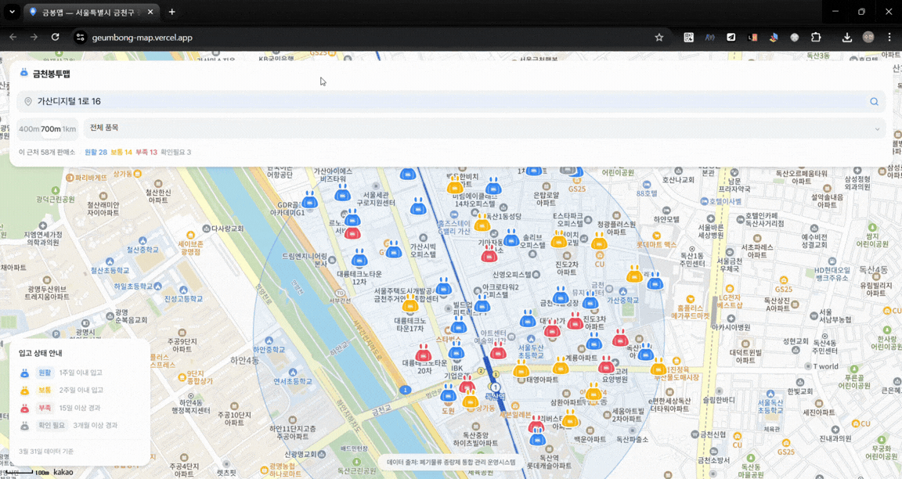

# 🗑️ 금천봉투맵 (Geum-Bong Map)
> **금천구 종량제 봉투 & 대형 폐기물 스티커 실시간 재고/위치 찾기**

> 🔗 **서비스 바로가기**: [https://geumbong-map.vercel.app/](https://geumbong-map.vercel.app/)


금천봉투맵은 구민들이 원하는 규격의 종량제 봉투 판매처를 지도에서 직관적으로 찾을 수 있게 도와주는 웹 앱입니다. 공공 데이터를 바탕으로 개별 판매소의 **최근 입고 일자를 분석**해 원활, 보통, 부족 상태를 예측하고 헛걸음을 방지해 줍니다.

---

## ✨ 특장점 및 핵심 UX (Features)

### 1. 실시간 위치/반경 검색 및 필터링
도로명 주소 검색 또는 내 위치(GPS) 버튼으로 현재 위치를 중심으로, 반경(400m / 700m / 1km) 및 품목 단위로 필터링해 주변 판매소를 즉시 조회할 수 있습니다. 검색 결과는 원활/보통/부족/확인필요 수로 요약 표시됩니다.


### 2. 위트 있고 직관적인 시각화
일반 지도 핀이 아닌 깔끔하게 디자인된 **종량제 봉투 실루엣 아이콘**을 렌더링하고, 재고 상태별로 색상(파랑: 원활 / 노랑: 보통 / 빨강: 부족 / 회색: 확인필요)을 매핑합니다. 좌측 하단 현황판 범례에서 상태 기준과 최신 데이터 기준일을 확인할 수 있습니다.


### 3. 마커 클릭 시 판매소 상세 정보
- **PC**: 마커 옆에 플로팅 InfoWindow로 표시
- **모바일**: 화면 하단에서 슬라이드업 BottomSheet으로 표시 (아래로 스와이프하면 닫힘)

상세 정보에는 입고 상태 배지, 상호명, 주소, 전화 연결 버튼, 품목별 최근 입고 현황이 포함됩니다.



### 4. 감성을 더한 '빈 상태(Empty State)' 대처
검색 반경 내에 판매소가 없을 경우, 반투명한 봉투가 "ㅠㅠ" 표정으로 눈물을 흘리며 통통 튀는 애니메이션을 보여줍니다. 반경이 최대가 아닌 경우 '반경 늘리기' 버튼도 함께 표시됩니다.


---

## 🏗 시스템 구조 (Architecture)
본 프로젝트는 **Vercel Serverless Function** 생태계를 사용하여 완전히 서버리스(Serverless)로 구동됩니다.

1. **API Proxy**: `/api/stores`, `/api/products`가 금천구 외부 API를 서버 사이드에서 호출해 브라우저 CORS 제약을 우회합니다. 판매소 데이터는 1시간, 품목 정보는 24시간 캐싱합니다.
2. **Frontend**: React 기반 Vite 앱으로 Vercel Edge 네트워크를 통해 제공됩니다.

## 🛠 사용된 기술 (Tech Stack)
- **Frontend**: React 19 (Vite 6), Tailwind CSS v4, Lucide React, Kakao Maps SDK
- **Backend**: Vercel Serverless Functions
- **Deployment**: Vercel
- **Data Source**: 금천구 종량제 봉투 시스템 API, Kakao Local API

## 📊 데이터 출처
- **폐기물류 종량제 통합 관리 운영시스템**: [https://geumcheon.jmtwaste.kr/jmfwaste/webBongtuSeller](https://geumcheon.jmtwaste.kr/jmfwaste/webBongtuSeller)

---

## 🚀 로컬 개발환경 실행 (Getting Started)

```bash
# 1. 패키지 설치
npm install

# 2. 환경변수 세팅
cp .env.example .env.local
# VITE_KAKAO_REST_API_KEY 와 VITE_KAKAO_JAVASCRIPT_KEY 환경변수 입력

# 3. 개발 서버 실행 (Vercel Serverless Functions 포함)
npx vercel dev
```
