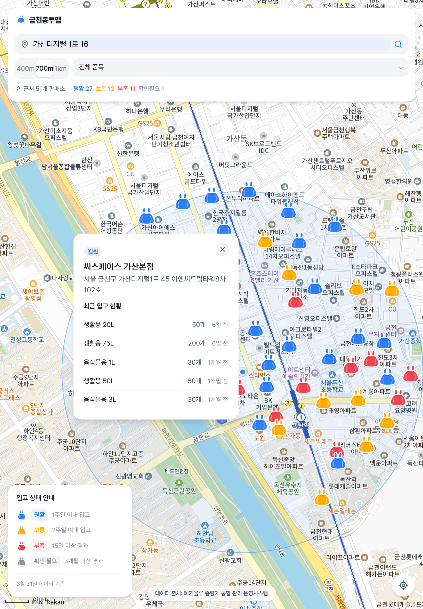
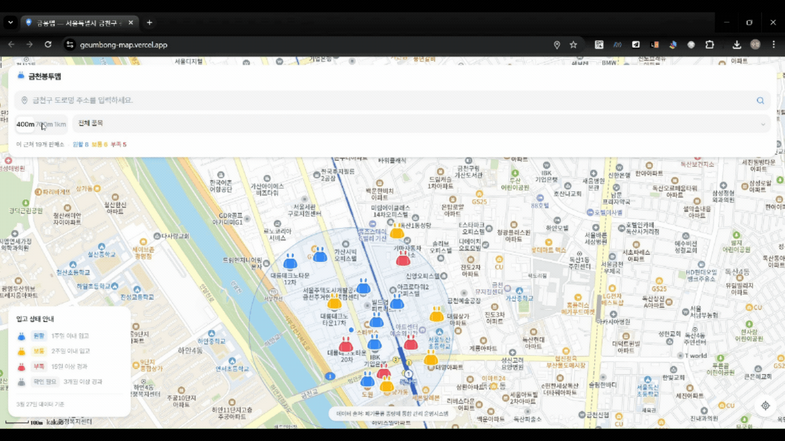

# 🗑️ 금천봉투맵 (Geum-Bong Map)
> **금천구 종량제 봉투 & 대형 폐기물 스티커 실시간 재고/위치 찾기**

> 🔗 **서비스 바로가기**: [https://geumbong-map.vercel.app/](https://geumbong-map.vercel.app/)



금천봉투맵은 구민들이 원하는 규격의 종량제 봉투 판매처를 지도에서 직관적으로 찾을 수 있게 도와주는 웹 앱입니다. 공공 데이터를 바탕으로 개별 판매소의 **최근 입고 일자를 분석**해 원활, 보통, 부족 상태를 예측하고 헛걸음을 방지해 줍니다.

---

## ✨ 특장점 및 핵심 UX (Features)

### 1. 실시간 위치/반경 검색 및 필터링
사용자가 원하는 주소를 검색하거나 반경(400m, 700m, 1km) 및 품목 단위로 필터링해 내 주변 판매소를 즉시 조회할 수 있습니다.


### 2. 위트 있고 직관적인 시각화
일반 지도 핀이 아닌 깔끔하게 디자인된 **종량제 봉투 실루엣 아이콘**을 렌더링하고, 재고 상태별로 색상(파랑: 원활 / 노랑: 보통 / 빨강: 부족 / 회색: 확인필요)을 매핑하여 사용자 인지를 높였습니다. 우측 하단의 현황판 범례를 통해 쉽게 확인할 수 있습니다.



### 3. 감성을 더한 '빈 상태(Empty State)' 대처
원하는 반경 내에 결과가 없을 경우 뜨는 "결과 없음" 화면을 위트 있게 풀어냈습니다. 단순히 텍스트만 보여주지 않고, 반투명한 거대 봉투가 화면 중앙에서 ㅠㅠ 눈물을 흘리며 통통 튀는 애니메이션을 보여줍니다. 

---

## 🏗 시스템 구조 (Architecture)
본 프로젝트는 **Vercel Serverless Function** 생태계를 사용하여 완전히 서버리스(Serverless)로 구동됩니다.

1. **API Proxy**: Vercel의 Serverless 함수 영역인 `/api/*`가 금천구 외부 API를 백엔드에서 대신 호출해 브라우저 CORS 제약을 우회합니다.
2. **Frontend**: React 기반 Vite 앱으로 구성되어 빠르고 가볍게 동작하며, Vercel Edge 네트워크를 타고 제공됩니다.

## 🛠 사용된 기술 (Tech Stack)
- **Frontend**: React (Vite), Tailwind CSS, Lucide React, Kakao Maps SDK
- **Backend**: Vercel Serverless Functions
- **Deployment**: Vercel
- **Data Source**: 금천구 종량제 봉투 시스템 API, Kakao Local API

## 📊 데이터 출처
- **종량제봉투 및 납부필증 판매소 위치검색시스템**: [https://geumcheon.jmtwaste.kr/jmfwaste/webBongtuSeller](https://geumcheon.jmtwaste.kr/jmfwaste/webBongtuSeller)

---

## 🚀 로컬 개발환경 실행 (Getting Started)

```bash
# 1. 패키지 설치
npm install

# 2. 환경변수 세팅
cp .env.example .env.local
# VITE_KAKAO_REST_API_KEY 와 VITE_KAKAO_JAVASCRIPT_KEY 환경변수 입력

# 3. 개발 서버 실행 (Vercel API Proxy를 포함해 실행)
npx vercel dev
```
